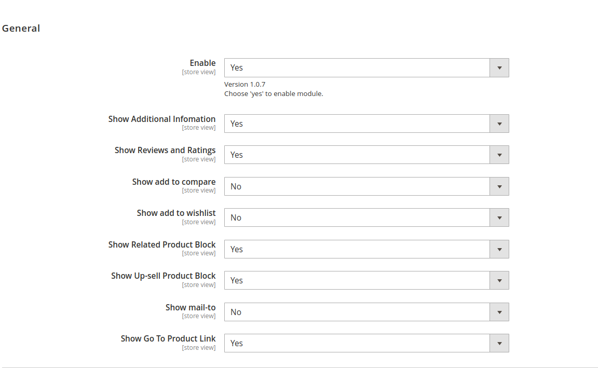
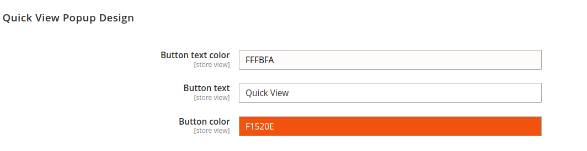

# Magento 2 Quickview Module

## Description
Enhance user experience on your Magento 2 store by enabling quick product previews directly from category pages using the Magento 2 Quickview Module. This module allows customers to view product details in a popup/modal without navigating to individual product pages, thereby reducing friction in the shopping process.

## Key Features

- **Quick Product Preview:** Allows users to view detailed product information without leaving the category page.
- **Ajax Integration:** Utilizes Ajax technology for seamless and fast loading of product details.
- **Customizable Design:** Supports customization of popup layout, content, and styles to match your store theme.
- **Mobile Responsive:** Ensures optimal performance and usability across various devices.
- **Compatibility:** Compatible with Magento 2.4.X and supports PHP versions 8.1 to 8.3.
- **Easy Installation:** Install via composer for straightforward setup and updates.
- **Update/Upgrade:** Easily update using composer and Magento CLI commands.
- **Error Handling:** Comprehensive error handling to ensure smooth operation.

## Benefits

- **Improved User Engagement:** Enhances user interaction by providing quick access to product information.
- **Faster Shopping Experience:** Saves time for customers by reducing navigation steps.
- **Increased Sales Conversion:** Facilitates quicker decision-making and potentially higher conversion rates.
- **Support and Documentation:** Dedicated support available for installation, customization, and troubleshooting.

## Installation:
*Install via composer (recommend)* - 

Easy installation process with step-by-step instructions provided for hassle-free setup.
~~~~~~~~~~~~~~~~~~~~~
composer require mavenbird/module-quickview 
php bin/magento setup:upgrade
php bin/magento setup:static-content:deploy
php bin/magento setup:di:compile
php bin/magento cache:flush
~~~~~~~~~~~~~~~~~~~~~   

## Upgrade/Update Module:
Run the following command in Magento 2 root folder for easy update -
~~~~~~~~~~~~~~~~~~~~~
composer update mavenbird/module-quickview
php bin/magento setup:upgrade
php bin/magento setup:static-content:deploy
php bin/magento setup:di:compile
php bin/magento cache:flush
~~~~~~~~~~~~~~~~~~~~~

## Customization Options:

*Configure at Your Ease*

## Support:
Dedicated support team available to assist with installation, customization, and any other queries or concerns.
*[support@mavenbird.com](mailto:support@mavenbird.com)* 

## Get Started:
Simplify the browsing experience for your customers with the Magento 2 Quickview Module. Enable quick product previews directly from category pages, allowing users to view detailed product information in a convenient popup/modal without navigating away from the category page.

*Thank you!*
